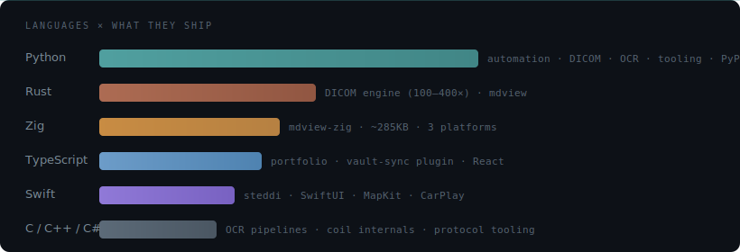

# nathan 👋

I build internal tools and native apps. The kind that connect systems no one designed to talk to each other, replace manual processes, and survive environments where "just use a SaaS" isn't an option. Most of my work lives in private repos under my org — here's what I can talk about.

---

### now

**[mdview-zig](https://github.com/nathannncurtis/mdview-zig)** — native markdown viewer in Zig. DirectWrite / Cairo / CoreText — ~285KB, no webview, no runtime.

**[Study Aggregator](https://github.com/nathannncurtis/Study-Aggregator)** — DICOM processor with a Rust engine. Zero-copy mmap parsing, parallel walks (rayon + jwalk). **100–400× faster** than pydicom.

**[commit-summarizer](https://github.com/nathannncurtis/commit-summarizer)** — GitHub → local Ollama → Slack. Commit summaries for non-technical stakeholders, entirely on-prem.

**[obsidian-vault-sync](https://github.com/nathannncurtis/obsidian-vault-sync)** — self-hosted real-time Obsidian sync. FastAPI + WebSocket + TypeScript plugin + Docker.

**[steddi](https://steddi.io)** — iOS navigation app for daily commuters. Swift, SwiftUI, MapKit, CarPlay. In development.

**[coil](https://github.com/nathannncurtis/coil)** — Python-to-executable compiler. Directory in, `.exe` out. Published on [PyPI](https://pypi.org/project/coil-compiler/).

---

### what I build

Document processing for legal and medical workflows — batch OCR, PDF compression, DICOM aggregation, image classification. Built around the actual hardware, network paths, and legacy software they have to survive in.

Cross-platform native tools where performance matters and a webview doesn't cut it.

Dashboards, operational automation, and the small utilities that save 20 minutes a day.

---

### stack

---

more at [nathancurtis.to](https://nathancurtis.to)
