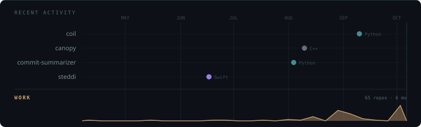

# nathan 👋

I build internal tools and native apps. The kind that connect systems no one designed to talk to each other, replace manual processes, and survive environments where "just use a SaaS" isn't an option. Most of my work lives in private repos under my org — here's what I can talk about.

Note: Spikes in contributions (150+ in a day) are bulk Dependabot updates across my personal and org repos

---

### now

**[mdview-zig](https://github.com/nathannncurtis/mdview-zig)** · Native markdown viewer in Zig. DirectWrite / Cairo / CoreText. ~285KB, no webview, no runtime.

**[Study Aggregator](https://github.com/nathannncurtis/Study-Aggregator)** · DICOM processor with a Rust engine. Zero-copy mmap parsing, parallel walks (rayon + jwalk). **100–400× faster** than pydicom.

**[commit-summarizer](https://github.com/nathannncurtis/commit-summarizer)** · GitHub → local Ollama → Slack. Commit summaries for non-technical stakeholders, entirely on-prem.

**[obsidian-vault-sync](https://github.com/nathannncurtis/obsidian-vault-sync)** · Self-hosted real-time Obsidian sync. FastAPI + WebSocket + TypeScript plugin + Docker.

**[steddi](https://steddi.io)** · iOS navigation app for daily commuters. Swift, SwiftUI, MapKit, CarPlay. In development.

**[coil](https://github.com/nathannncurtis/coil)** · Python-to-executable compiler. Directory in, `.exe` out. Published on [PyPI](https://pypi.org/project/coil-compiler/).

**[canopy](https://github.com/nathannncurtis/canopy)** · Fast Windows disk space analyzer. Direct NTFS MFT enumeration, squarified treemap, Fluent Design UI.

---

### what I build

Document processing for legal and medical workflows: batch OCR, PDF compression, DICOM aggregation, image classification. Built around the actual hardware, network paths, and legacy software they have to survive in.

On-prem document AI: local vision-LLM inference (vLLM, FP8) that verifies legal record productions the way a clerk does. **1,700 pages in 18 seconds** on a single workstation GPU, because the documents can't leave the building.

Cross-platform native tools where performance matters and a webview doesn't cut it.

Dashboards, operational automation, and the small utilities that save 20 minutes a day.

---

### tech

      ![C#](https://img.shields.io/badge/C%23-239120?style=flat&logo=data%3Aimage%2Fsvg%2Bxml%3Bbase64%2CPHN2ZyBmaWxsPSJ3aGl0ZSIgcm9sZT0iaW1nIiB2aWV3Qm94PSIwIDAgMjQgMjQiIHhtbG5zPSJodHRwOi8vd3d3LnczLm9yZy8yMDAwL3N2ZyI%2BPHRpdGxlPkMjPC90aXRsZT48cGF0aCBkPSJNMS4xOTQgNy41NDN2OC45MTNjMCAxLjEwMy41ODggMi4xMjIgMS41NDQgMi42NzRsNy43MTggNC40NTZhMy4wODYgMy4wODYgMCAwIDAgMy4wODggMGw3LjcxOC00LjQ1NmEzLjA4NyAzLjA4NyAwIDAgMCAxLjU0NC0yLjY3NFY3LjU0M2EzLjA4NCAzLjA4NCAwIDAgMC0xLjU0NC0yLjY3M0wxMy41NDQuNDE0YTMuMDg2IDMuMDg2IDAgMCAwLTMuMDg4IDBMMi43MzggNC44N2EzLjA4NSAzLjA4NSAwIDAgMC0xLjU0NCAyLjY3M1ptNS40MDMgMi45MTR2My4wODdhLjc3Ljc3IDAgMCAwIC43NzIuNzcyLjc3My43NzMgMCAwIDAgLjc3Mi0uNzcyLjc3My43NzMgMCAwIDEgMS4zMTctLjU0Ni43NzUuNzc1IDAgMCAxIC4yMjYuNTQ2IDIuMzE0IDIuMzE0IDAgMSAxLTQuNjMxIDB2LTMuMDg3YzAtLjYxNS4yNDQtMS4yMDMuNjc5LTEuNjM3YTIuMzEyIDIuMzEyIDAgMCAxIDMuMjc0IDBjLjQzNC40MzQuNjc4IDEuMDIzLjY3OCAxLjYzN2EuNzY5Ljc2OSAwIDAgMS0uMjI2LjU0NS43NjcuNzY3IDAgMCAxLTEuMDkxIDAgLjc3Ljc3IDAgMCAxLS4yMjYtLjU0NS43Ny43NyAwIDAgMC0uNzcyLS43NzIuNzcxLjc3MSAwIDAgMC0uNzcyLjc3MlptMTIuMzUgMy4wODdhLjc3Ljc3IDAgMCAxLS43NzIuNzcyaC0uNzcydi43NzJhLjc3My43NzMgMCAwIDEtMS41NDQgMHYtLjc3MmgtMS41NDR2Ljc3MmEuNzczLjc3MyAwIDAgMS0xLjMxNy41NDYuNzc1Ljc3NSAwIDAgMS0uMjI2LS41NDZ2LS43NzJIMTJhLjc3MS43NzEgMCAxIDEgMC0xLjU0NGguNzcydi0xLjU0M0gxMmEuNzcuNzcgMCAxIDEgMC0xLjU0NGguNzcydi0uNzcyYS43NzMuNzczIDAgMCAxIDEuMzE3LS41NDYuNzc1Ljc3NSAwIDAgMSAuMjI2LjU0NnYuNzcyaDEuNTQ0di0uNzcyYS43NzMuNzczIDAgMCAxIDEuNTQ0IDB2Ljc3MmguNzcyYS43NzIuNzcyIDAgMCAxIDAgMS41NDRoLS43NzJ2MS41NDNoLjc3MmEuNzc2Ljc3NiAwIDAgMSAuNzcyLjc3MlptLTMuMDg4LTIuMzE1aC0xLjU0NHYxLjU0M2gxLjU0NHYtMS41NDNaIi8%2BPC9zdmc%2B)       

            

     

                 

    

---

---

get to know me better at [nathancurtis.to](https://nathancurtis.to)
